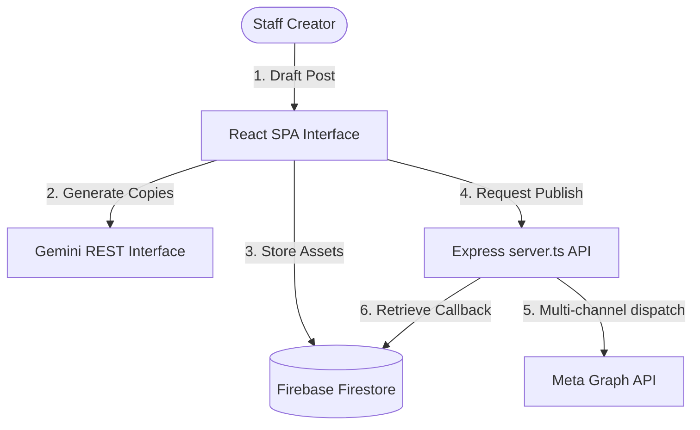
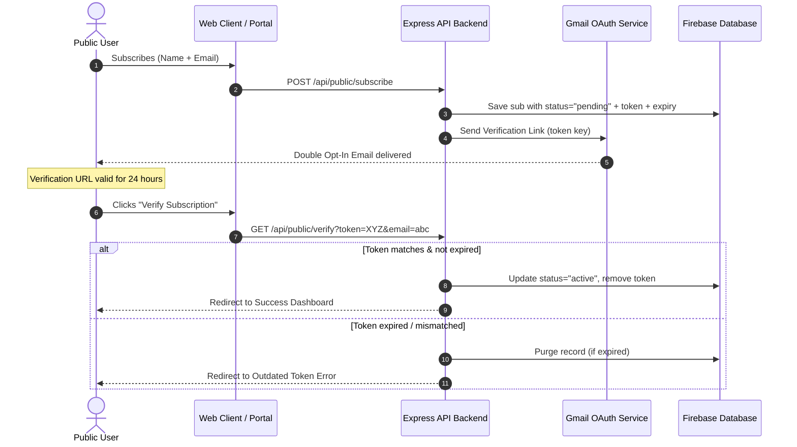

# Marketing Content Planner & Subscriber Portal

A comprehensive, production-ready enterprise social media content planner and email marketing/newsletter subscriber portal. This platform features robust, visual multi-view planners, Google Gemini AI draft suggestion engines, native Meta (Facebook & Instagram Business) publishing proxies, and an authorized, transactional Gmail campaign system implementing GDPR-compliant secure Double Opt-In subscriber pipelines and detailed feedback auditing.

---

## 🚀 Key Capability Modules

### 1. Unified Social Media Hub & Planner
*   **Dynamic Views:** Manage deliverables across standard list views, drag-and-drop Kanban boards, or calendar timelines.
*   **GenAI Amplification:** Write high-converting post copies, brainstorm graphic styles, or audit readability using Google Gemini AI integrations.
*   **Page Automation:** Publish and schedule posts directly to Facebook Pages and Instagram accounts through secure, client-hidden proxy endpoints.
*   **Real-time Analytics:** Track and consolidate engagement (likes, reacts, comment trees, and organic shares) dynamically.

### 2. GDPR-Compliant Subscriber Portal
*   **Double Opt-In Verification:** A fully integrated transactional pipeline that requires target recipients to confirm clicks within a customizable 24-hour token expiration window before activation.
*   **Granular Subscriber Segmentation:** Manage individual custom tags (e.g., *IT Intern*, *Newsletter*, *Customer Success*) to filter, target, or segment broadcasts cleanly.
*   **Feedback Auditing & GDPR Opt-Out logs:** Comprehensive tracking allows users to catalog reasons (e.g., frequency, content mismatch, custom feedback) upon opt-out. Staff can filter, bulk reset, or permanently purge logs to satisfy absolute deletion standards.

---

## 🛠️ Tech Stack & Dependencies

### Frontend Core
*   **Framework:** React 19 (running on standard Vite engine)
*   **TypeScript:** Full schema-backed type configuration for Firestore records and Meta payloads.
*   **Styling:** Tailwind CSS (utility-first, rich negative spacing, high contrast, amber/emerald theme accents).
*   **Animations:** Framer Motion for highly fluid tab transitions, modal entries, and tag toggles.
*   **Icons & Visuals:** Lucide React vector suite.

### Backend & Service Endpoints
*   **Node.js Server:** Express server configured with hot Vite serverless middleware bindings for development and stand-alone static folder distribution for production.
*   **Production Build Engine:** bundled with Esbuild into unified standalone outputs.
*   **Database & Storage:** Google Firebase Firestore & Authentication for team role authorization and permanent operational logs.
*   **SMTP Proxy:** Google Gmail Oauth APIs for secure, authenticated broadcast campaigns.

---

## 📋 Quick Setup & Installation

### Prerequisite Environment
*   **Runtime:** Node.js (v18 or higher)
*   **Database:** A Google Firebase Project running Firestore in native mode.
*   **OAuth Application:** Google Cloud Platform developer console client ID & secret with `gmail.send` and `gmail.readonly` scopes configured.
*   **Meta SDKs:** Facebook developer console token with Page management scopes.

### 1. Project Initialization
```bash
# Clone the codebase
git clone <your-repository-url>
cd marketing-content-planner

# Install dependencies from package.json
npm install
```

### 2. Environment Variables Configuration
Create a `.env` file in the root directory. You can copy format guidelines from `.env.example`:

```env
# Google Gemini Engine Secret
GEMINI_API_KEY=AIzaSy...

# Meta Business Proxy Configuration
FACEBOOK_PAGE_ACCESS_TOKEN=EAAB...
FACEBOOK_PAGE_ID=123456789...

# Google Gmail OAuth Client Credentials
GMAIL_CLIENT_ID=348...content.googleusercontent.com
GMAIL_CLIENT_SECRET=GOCSPX-...
GMAIL_REDIRECT_URI=https://your-domain.com/api/gmail/callback

# Client-Exposed Web Firebase Settings (Used for active subscriber list syncing)
VITE_FIREBASE_API_KEY=AIzaSy...
VITE_FIREBASE_AUTH_DOMAIN=app-id.firebaseapp.com
VITE_FIREBASE_DATABASE_ID=(default)
VITE_FIREBASE_PROJECT_ID=app-id
VITE_FIREBASE_STORAGE_BUCKET=app-id.appspot.com
VITE_FIREBASE_MESSAGING_SENDER_ID=987654321
VITE_FIREBASE_APP_ID=1:223344...
```

### 3. Execution Commands
```bash
# Start in developmental hot-reload mode
npm run dev

# Compile standalone front + back assets for high performance
npm run build

# Boot secure standalone node server mapping dist folders
npm start
```

---

## 🗺️ System Workflow Diagrams

### Module Architecture Workflow


### Subscriber Lifecycle & Double Opt-In Workflow


### Campaign Broadcast & Automation Scheduler Flow
```mermaid
graph TD
    A[Cron Job / Background Interval: Each 60s] --> B{Gmail Configured & Active?}
    B -->|No| C[Sleep / Idle]
    B -->|Yes| D[Query Scheduled Campaigns in DB]
    D --> E{Any Campaign scheduledAt <= Now?}
    E -->|No| C
    E -->|Yes| F[Set Campaign Status to "sending" in Firestore]
    F --> G[Extract Selected Tag Filters]
    G --> H[Fetch Active Verified Subscribers matching tags]
    H --> I[Compile Body & Inject personal variables & Unsubscribe token]
    I --> J[Encode MIME Multi-part with attachments]
    J --> K[POST /users/me/messages/send on Gmail API]
    K --> L[Update counts: Sent / Failed in DB]
    L --> M{More recipients remaining?}
    M -->|Yes| J
    M -->|No| N[Mark Campaign Status as "sent" in Firestore]
```

---

## 📡 Backend API Documentation

### Gmail Authentication
All actions below are proxies running server side to ensure complete secret safety.

#### 1. Retrieve Authentication Consent URL
Builds the required callback parameters dynamically to route credentials safely.
*   **Endpoint:** `POST /api/gmail/auth-url`
*   **Request Headers:** `Content-Type: application/json`
*   **Request Payload:**
```json
{
  "origin": "https://yourapp.example.com"
}
```
*   **Example Response (Success):**
```json
{
  "url": "https://accounts.google.com/o/oauth2/v2/auth?client_id=348...&redirect_uri=..."
}
```

#### 2. Get Integration Status
*   **Endpoint:** `GET /api/gmail/status`
*   **Example Response (Connected):**
```json
{
  "connected": true,
  "authorizedEmail": "marketing-leads@organization.org"
}
```

#### 3. Revoke / Disconnect Credentials
*   **Endpoint:** `DELETE /api/gmail/disconnect`
*   **Example Response:**
```json
{
  "success": true
}
```

---

### Campaign and Newsletter Delivery
Integrate attachment formats, rich template builders, and custom placeholders.

#### 1. Instant Campaign Send Dispatch
*   **Endpoint:** `POST /api/gmail/send-bulk`
*   **Request Payload:**
```json
{
  "campaignId": "cmp_fall_release_001",
  "recipients": [
    { "name": "Sarah Connor", "email": "sconnor@cyberdyne.info" },
    { "name": "John Doe", "email": "jdoe@gmail.com" }
  ]
}
```
*   **Example Response:**
```json
{
  "success": true,
  "message": "Campaign sending started in background."
}
```

---

### Public GDPR Subscriber Administration

#### 1. Start Subscription (Double Opt-In registration)
*   **Endpoint:** `POST /api/public/subscribe`
*   **Request Payload:**
```json
{
  "name": "Jane Doe",
  "email": "jane.doe@example.com",
  "tags": ["Tech Interns", "Weekly Feature Digest"]
}
```
*   **Example Response (Success):**
```json
{
  "success": true,
  "emailSent": true,
  "verificationNeeded": true,
  "devVerificationUrl": "https://yourdomain.com/api/public/verify?token=3j8dxh...&email=jane.doe@example.com"
}
```

#### 2. Verify Token & Activate
*   **Endpoint:** `GET /api/public/verify`
*   **Query Parameters:**
```text
?token=3j8dxh...&email=jane.doe@example.com
```
*   **Response:** Redirects client browser to `/subscribe?verified=success&email=jane.doe@example.com` on matching successful records.

#### 3. Safe Unsubscribe (Granular Reason cataloging)
*   **Endpoint:** `POST /api/public/unsubscribe`
*   **Request Payload:**
```json
{
  "email": "jane.doe@example.com",
  "reason": "Sending frequency was too high. I prefer monthly summaries."
}
```
*   **Example Response:**
```json
{
  "success": true,
  "found": true
}
```

---

### Meta (Facebook / Instagram) Publishing

#### 1. Publish Multi-channel Live Post
*   **Endpoint:** `POST /api/meta-post`
*   **Request Payload:**
```json
{
  "message": "Take a look at our brand next-gen design setup! Let us know what you think.",
  "platforms": ["facebook", "instagram"],
  "mediaUrls": ["data:image/png;base64,iVBORw0KGgoAAAANSUh..."]
}
```
*   **Example Response:**
```json
{
  "success": true,
  "results": {
    "facebook": "post_178414002345672",
    "instagram": "media_179213009876214"
  }
}
```

#### 2. Get Live Engagement Analytics
*   **Endpoint:** `GET /api/meta-post/:postId/metrics?platform=facebook`
*   **Example Response (Success):**
```json
{
  "success": true,
  "metrics": {
    "reactions": 852,
    "comments": 143,
    "shares": 54
  }
}
```

---

## 🔒 Governance & Operational Safety

1.  **Strict Token Enclosure:** Sensitive administrative tokens (GCP Credentials, Meta Business Graph Keys) are locked inside the node environment server-side. Client scripts only interact via mapped proxy layers.
2.  **Robust Feedback Administration:** Subscribers page has dedicated actions for managers to:
    *   *Clear single feedback details* (resets individual logs back to "No reason specified").
    *   *Bulk clean filtered list records* (completely purge matching unsubscribe metrics or reset reasons).
3.  **Automatic expired pending removal:** A background routine purges inactive subscriptions after 24 hours to minimize database tables bloat and respect security hygiene standards.
# STLAF_Newletter
